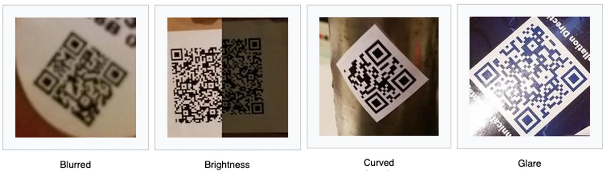
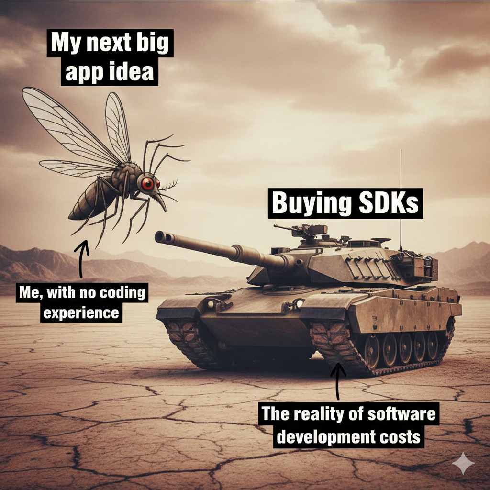

## Requirements and Constraints

I worked on a fin-tech mobile web app with features such as:

- **Card registration**: Scanning barcodes(CODE_128) from physical cards in indoor low-light conditions
- **QR payment**: Scanning QR(CODE_39) codes from merchant outlets, supporting outdoor conditions with partially damaged, rotated, or moving codes

My solution needed to be:

1. **Accurate**: Reading a wrong card number or an invalid merchantID would result in bad UX and mean loss for business.
2. **Fast**: Although the features had a maximum 30-second timeout for scanning, users are habituated to scan codes in sub-second periods. Ensuring a smooth user experience with instantaneous scan results was my responsibility.
3. **Handle edge cases**: The scanner should perform in low-light and glared conditions, on partially damaged surfaces, and with rotated or moving codes.

   

## What I Tried First: Popular JS Libraries

Heads up: We are a fast-paced, delivery-focused offshore team. We don't have the luxury to perform full-scale R&D on a feature from scratch. Naturally, I searched for OSS solutions and gave them a shot.

### 1. <a href="https://github.com/zxing-js/library" target="_blank" rel="noopener noreferrer">ZXing-JS</a> (`@zxing/library`)

ZXing-JS is the browser implementation of the famous ZXing Java library. It's open-source, has a wide community, and is the most adopted JavaScript library for barcode scanning based on GitHub stars (~3.4k stars).

**How I implemented it:**

I used the `BrowserMultiFormatReader` class from `@zxing/library`. The implementation was straightforward:

```jsx
import { BrowserMultiFormatReader, NotFoundException } from "@zxing/library";

const codeReader = new BrowserMultiFormatReader();

// Start decoding from video device
await codeReader.decodeFromVideoDevice(
  null, // null = default camera
  videoElement,
  (result, error) => {
    if (result) {
      // Handle successful scan
      console.log(result.getText());
      console.log(result.getBarcodeFormat());
    }
    if (error && !(error instanceof NotFoundException)) {
      // Handle error (NotFoundException is thrown when no barcode found in frame)
      console.error(error);
    }
  },
);

// To stop scanning
codeReader.reset();
```

**Why it failed for my use case:**

As the easiest choice, I went with it and gave it a try...until it reached QA, where it was tested against different variants' shapes, lights, and rotations of cards. Not surprisingly, although it was instantaneous during my dev test (for a small sample of codes I was provided with), it largely failed to be "fast." It usually took holding the phone for over 10 seconds with a stable sample code behind the camera.

Three reasons I identified why it failed:

1. **ZXing is not optimized for real-time camera feed scanning**: You periodically take a picture, pre-process the image to fix lighting/rotation, then serve the image to ZXing and hope for the best. The library doesn't have built-in barcode localization.
2. **It doesn't work for damaged or even slightly rotated codes**: ZXing expects the barcode to be relatively aligned with the viewport.
3. **My mistake**: Instead of snapping and cropping only the QR/barcode area of the camera feed, I served the whole 1920×1080 image to ZXing, so it had to struggle to figure out the exact part where the barcode resides.

I was able to make it a bit faster by pre-processing the frame better and sacrificing accuracy. But false positive results were not acceptable for my project.

**When to choose ZXing-JS:**

If you have relatively simple and sharp images of barcodes (e.g., user uploads barcode images, or scans directly from a digital screen), you can choose ZXing. It works well for static image processing.

---

### 2. <a href="https://github.com/serratus/quaggajs" target="_blank" rel="noopener noreferrer">QuaggaJS</a> / <a href="https://github.com/ericblade/quagga2" target="_blank" rel="noopener noreferrer">Quagga2</a> (`@ericblade/quagga2`)

After my scanner V1 failed QA, I replaced ZXing with QuaggaJS (Quagga2 to be exact, as the original is no longer maintained).

**Key difference from ZXing:**

Quagga is "not yet another port of the great ZXing library, but more of an extension to it. This implementation features a **barcode locator** which is capable of finding a barcode-like pattern in an image resulting in an estimated bounding box including the rotation. Simply speaking, this reader is **invariant to scale and rotation**, whereas other libraries require the barcode to be aligned with the viewport."

In simpler terms, Quagga handles the pre-processing (cropping, rotating, color correcting) of the image frame, then passes it to ZXing's reader.

**How I implemented it:**

```jsx
import Quagga from "@ericblade/quagga2";

Quagga.init(
  {
    inputStream: {
      name: "Live",
      type: "LiveStream",
      target: containerElement,
      constraints: {
        width: 640,
        height: 480,
        facingMode: "environment", // Use rear camera
      },
    },
    decoder: {
      readers: ["code_128_reader", "code_39_reader"],
    },
    locate: true, // Enable barcode locator
    locator: {
      patchSize: "medium", // Affects accuracy vs speed
      halfSample: true, // Downsample for performance
    },
    numOfWorkers: 2, // Web workers for parallel processing
    frequency: 10, // Scans per second
  },
  (err) => {
    if (err) {
      console.error(err);
      return;
    }

    Quagga.start();

    Quagga.onDetected((result) => {
      console.log(result.codeResult.code);
      console.log(result.codeResult.format);
    });
  },
);

// To stop
Quagga.stop();
```

**Why it failed for my use case:**

In my experience, Quagga performed much faster to return read results. Sadly, it resulted in many **false positive reads**. I had to ensure proper validation of my expected result string because Quagga's result can't be directly trusted. The locator sometimes found patterns that looked like barcodes but weren't, leading to garbage output.

**When to choose Quagga2:**

If you need **rotation-invariant** detection and can validate the scanned results on your backend (e.g., checking if the scanned card number exists in your database), Quagga is a solid choice. Just don't blindly trust the output.

---

## Considering Paid SDKs



If you are building a factory barcode scanner device and need to multi-scan 'lots' of codes at once, hands down, go for a paid SDK that fits your needs. In all the benchmarks, paid SDKs always win over OSS ones for edge cases, accuracy, and speed.

**Popular paid options:**

| SDK                                                                                                            | Strengths                                                          | Pricing Model |
| -------------------------------------------------------------------------------------------------------------- | ------------------------------------------------------------------ | ------------- |
| <a href="https://demo.dynamsoft.com/document-scanner/" target="_blank" rel="noopener noreferrer">Dynamsoft</a> | 60fps scanning, multi-code detection, excellent edge case handling |
| <a href="https://scanbot.io/" target="_blank" rel="noopener noreferrer">Scanbot</a>                            | Great mobile web performance, good documentation                   |
| <a href="https://www.scandit.com/" target="_blank" rel="noopener noreferrer">Scandit</a>                       | Enterprise-grade, AR overlays, MatrixScan                          |

Just to save you a Google search, I found <a href="https://demo.dynamsoft.com/document-scanner/" target="_blank" rel="noopener noreferrer">Dynamsoft's Demo</a> to be the North Star of all readers in the market.

For most web apps, an industry-grade scanner is well beyond the demand. Most apps will be fine implementing an open-source scanner. And needless to say, I was in a position where convincing the client to buy a paid SDK would be nearly impossible, and my project also didn't require factory-level speed or multi-scanning features. So I chose not to explore paid SDKs further.

---

## The Winner: <a href="https://developer.mozilla.org/en-US/docs/Web/API/Barcode_Detection_API" target="_blank" rel="noopener noreferrer">Barcode Detection API</a> + ZXing WASM Polyfill

After 3 days of trial and error and almost a week of frustration, along came the blessing of GPT, which enlightened me about the existence of a **native implementation** of barcode detection in browsers.

### What is the Barcode Detection API?

The <a href="https://developer.mozilla.org/en-US/docs/Web/API/Barcode_Detection_API" target="_blank" rel="noopener noreferrer">Barcode Detection API</a> is part of the Shape Detection API and is natively supported in:

- ✅ Chrome (Android) 83+
- ✅ Chrome (Desktop) 83+ (behind flag, macOS only with native support)
- ✅ Edge 83+
- ✅ Opera 70+
- ❌ Firefox (not supported)
- ❌ Safari (not supported, but the polyfill works)

The magic? **It uses the device's native barcode detection capabilities**, often hardware-accelerated through the camera driver or OS-level APIs, making it significantly faster than JavaScript-based solutions.

### Basic Usage

```jsx
// Check if supported
if ("BarcodeDetector" in window) {
  // Get supported formats
  const supportedFormats = await BarcodeDetector.getSupportedFormats();
  console.log(supportedFormats);

  // Create detector
  const barcodeDetector = new BarcodeDetector({
    formats: ["code_39", "code_128"],
  });

  // Detect from video frame or image
  const barcodes = await barcodeDetector.detect(videoElement);
  barcodes.forEach((barcode) => {
    console.log(barcode.rawValue); // The decoded string
    console.log(barcode.format); // e.g., 'code_128'
    console.log(barcode.boundingBox); // DOMRectReadOnly, useful if you want a draw custom ui or focus boxes.
    console.log(barcode.cornerPoints); // [{x, y}, ...]
  });
}
```

### The Browser Support Problem (and Solution)

The API isn't supported everywhere, especially Firefox and Safari. That's where the **polyfill** comes in.

I used the <a href="https://www.npmjs.com/package/barcode-detector" target="_blank" rel="noopener noreferrer">`barcode-detector`</a> package which provides:

1. **Native API** when available (fastest)
2. **ZXing WASM polyfill** as fallback (still faster than pure JS)

```jsx
import {
  BarcodeDetector,
  ZXING_WASM_VERSION,
  prepareZXingModule,
} from "barcode-detector/ponyfill";

// Configure WASM module loading
prepareZXingModule({
  overrides: {
    locateFile: (path, prefix) => {
      if (path.endsWith(".wasm")) {
        return `https://unpkg.com/zxing-wasm@${ZXING_WASM_VERSION}/dist/reader/${path}`;
      }
      return prefix + path;
    },
  },
});

// Now use BarcodeDetector normally
const detector = new BarcodeDetector({ formats: ["code_128", "code_39"] });
```

### My Complete Implementation

Here's the key architecture of my final solution:

**1. Camera Setup with Focus Area Cropping**

One crucial optimization: instead of sending the full 1920×1080 video frame to the detector, I crop to just the focus area:

```jsx
const getFocusAreaBounds = () => {
  const video = videoRef.current;
  const videoRect = video.getBoundingClientRect();

  // Focus area dimensions - responsive for mobile
  const focusWidth = Math.min(300, window.innerWidth * 0.8);
  const focusHeight = Math.min(160, window.innerHeight * 0.2);

  // Calculate focus area position (center of screen)
  const focusX = (videoRect.width - focusWidth) / 2;
  const focusY = (videoRect.height - focusHeight) / 2;

  // Convert to video coordinates
  const scaleX = video.videoWidth / videoRect.width;
  const scaleY = video.videoHeight / videoRect.height;

  return {
    x: focusX * scaleX,
    y: focusY * scaleY,
    width: focusWidth * scaleX,
    height: focusHeight * scaleY,
  };
};

const cropVideoToFocusArea = (video) => {
  const focusArea = getFocusAreaBounds();
  const canvas = canvasRef.current;
  const ctx = canvas.getContext("2d");

  // Set canvas size to focus area
  canvas.width = focusArea.width;
  canvas.height = focusArea.height;

  // Draw only the cropped video frame
  ctx.drawImage(
    video,
    focusArea.x,
    focusArea.y,
    focusArea.width,
    focusArea.height,
    0,
    0,
    focusArea.width,
    focusArea.height,
  );

  return canvas;
};
```

**2. Real-time Detection Loop**

Using `requestAnimationFrame` for smooth detection:

```jsx
const detectBarcodes = async () => {
  if (!isScanningRef.current) return;

  try {
    const croppedCanvas = cropVideoToFocusArea(videoRef.current);
    if (croppedCanvas) {
      const barcodes = await detectorRef.current.detect(croppedCanvas);

      if (barcodes.length > 0) {
        const barcode = barcodes[0];
        handleBarcodeDetected(barcode);
        return; // Stop scanning on success
      }
    }
  } catch (error) {
    console.error("Detection error:", error);
  }

  // Continue scanning
  animationRef.current = requestAnimationFrame(detectBarcodes);
};
```

**3. Camera Configuration**

High resolution for better detection:

```jsx
const stream = await navigator.mediaDevices.getUserMedia({
  video: {
    facingMode: "environment", // Rear camera
    width: { ideal: 1920 },
    height: { ideal: 1080 },
  },
});
```

### Performance Comparison

| Library                | Detection Speed | Accuracy                 | Rotation Support | Bundle Size              |
| ---------------------- | --------------- | ------------------------ | ---------------- | ------------------------ |
| ZXing-JS               | ~300-500ms      | Good                     | ❌               | ~200KB                   |
| Quagga2                | ~100-200ms      | Medium (false positives) | ✅               | ~150KB                   |
| Native API             | ~16-50ms        | Excellent                | ✅               | 0KB (native)             |
| Native + WASM Polyfill | ~50-100ms       | Excellent                | ✅               | ~2MB (WASM, lazy loaded) |

<iframe width="100%" height="315" src="https://www.youtube.com/embed/_pykgAz4JO8?si=ygT-qz0PPTdhoiOd" title="YouTube video player" frameborder="0" allow="accelerometer; autoplay; clipboard-write; encrypted-media; gyroscope; picture-in-picture; web-share" referrerpolicy="strict-origin-when-cross-origin" allowfullscreen></iframe>

---

## Summary: Decision Tree

```
Need barcode/QR scanning?
│
├─ Static image processing only? ──────────► Use ZXing-JS
│
├─ Need rotation-invariant detection?
│   └─ Can validate results on backend? ───► Use Quagga2
│
├─ Need physical barcode reader's performance?
│   └─ Multi-scan, 60fps, edge cases? ─────► Pay for Dynamsoft/Scanbot
│
└─ General web app, good-enough speed?
    └─ Most real-world use cases ──────────► Barcode Detection API
```

---

- **Try the demo app**: <a href="http://barcode-scanner.sk-salman.com" target="_blank" rel="noopener noreferrer">barcode-scanner.sk-salman.com</a>
- **Source code of demo**: <a href="https://github.com/IamSAL/barcode-scanner-demo" target="_blank" rel="noopener noreferrer">github.com/IamSAL/barcode-scanner-demo</a>

---

## Key Takeaways

1. **Crop your input**: Don't feed the full camera frame to any detector. Crop to a focus area for speed and accuracy.
2. **Use `requestAnimationFrame`**: For real-time scanning, use rAF instead of `setInterval` for smoother performance.
3. **The Barcode Detection API is underrated**: Browser support issue is rendered practically irrelevant by WASM polyfill.
4. **Validate your results**: Especially with Quagga, always validate scanned values against expected formats or backend data.
5. **Consider UX**: Show a focus area overlay to guide users where to position the barcode, this with proper cropping dramatically improves scan success rate.

> **Disclaimer:** This article is based on my personal experience. My usage of the libraries and my use case may differ from yours. Please consider your specific requirements when evaluating these tools.
