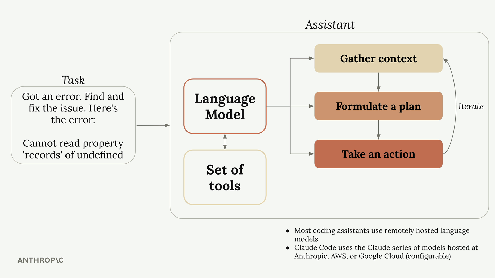
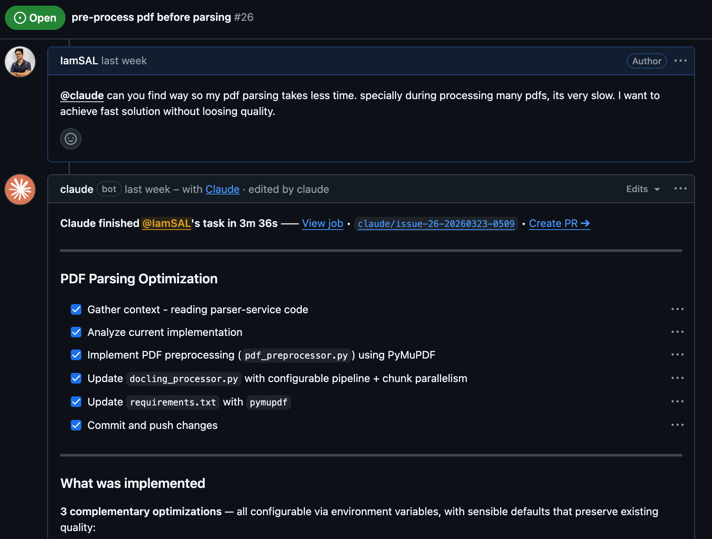
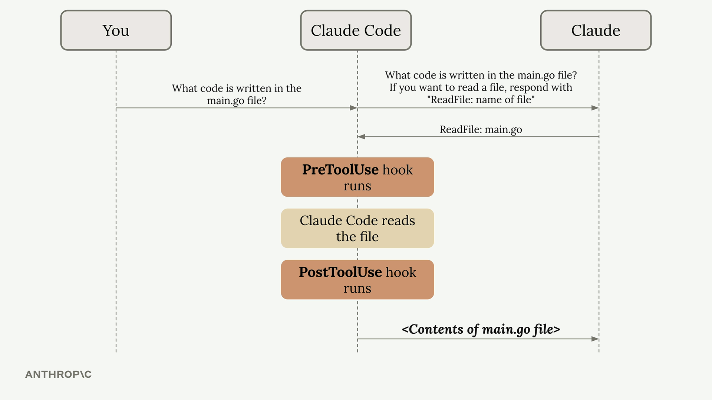

Recently, I checked out the short course from Anthropic called <a href="https://anthropic.skilljar.com/claude-code-in-action" target="_blank" rel="noopener noreferrer">Claude Code in Action</a>. This is a note on my learnings.

## What is a Coding Assistant?

Language Models are just text-in, text-out autocompletion engines. They don't know how to read/write files, make requests etc. LLMs need to interact with the outside world, reading files, fetching documentation, running commands, or editing code. A coding assistant sits in the middle of user and LLM and helps to **gather context, formulate a plan, and take action** with "**tool use.**"



## Why Claude Code(Compared to other coding agents)?

- Claude can **combine different tools** to handle complex work and will use tools it hasn't seen before
- It **doesn't rely on indexing the codebase** (which means sending your entire codebase to some external service). Instead it has strong and extensible tool usage to navigate codebases
- Not all language models/assistants are equally good at using tools
- Has built-in tools (Glob, Bash, WebFetch, WebSearch, MultiEdit) and also supports external tools (Playwright MCP, GitHub PR tools etc)

# Hands On

## Adding Context

**Context is key.** Too less context or too much irrelevant context and it will start hallucinating.

One easy way to create a persistent context is the **`/init` command**. It creates a summary of the project's purpose, tech stack, architecture, critical files and commands etc. and places them into a file called **`CLAUDE.md`** (passed in every request to the LLM).

Similar to env files, **CLAUDE.md can exist at multiple levels**:

1. **CLAUDE.md**: created by `/init`, shared with other team members in the repo
2. **CLAUDE.local.md**: personal instructions and customizations, gitignored
3. **~/.claude/CLAUDE.md**: general instructions to follow on all projects in your machine

We can manually modify this file. Or we can **prepend `#` in our prompts while chatting **to instruct claude to update the CLAUDE.md (aka memory) intelligently based on that prompt.

Instead of vague single-line prompts we can include relevant files so claude doesn't have to glob around, we can mention files by `@`. Its possible and recommended to mention critical files (like your db-schema) in `CLAUDE.md` so they always stay in context. This may seem to cost more tokens, but actually its better and faster than claude trying to guess > search > read among many files on each request.

Claude Code TUI supports pasting images/screenshots. Also can fetch context from remote through MCP (Figma MCP, Context7 for library docs etc).

## Making Changes

### Plan Modes

For complex tasks that may require claude to do a lot of searching and reading, we can switch to **plan mode** (`Shift+Tab`) so it prepares and shows us a plan before modifying code. We can accept or let it keep planning more thoroughly. Best useful for a task that seems "breadth first", requiring wide aspect and reading many files of the project, also for tasks that might need to break into multiple steps.

### Thinking Modes

If we want more than basic reasoning, adding **"think more", "think longer", "ultrathink"** in the prompt signals claude to budget more tokens and reason the task more deeply. Best useful for "depth first" tasks, like a particular tricky logic or solving difficult bugs.

Plan mode and thinking mode can be used together for really complex and multi-step tasks. But be mindful of token usage.

## Controlling Context

You'll often need to guide the conversation to keep it focused and productive, specially in long running conversations, or when transitioning to a different task.

- **Esc**: When claude derails out of the instruction, press esc and write instruction to redirect to your target approach
- **Double-Esc**: Show conversation/task history, so you re-use context of that and start a new task
- **Prepend `#`**: If claude keeps making same mistakes repeatedly, quickly tell claude to keep that in mind next time (persistent CLAUDE.md memory)
- **/compact**: Summarize context from previous conversation, reduce token usage but keep key insights for next task
- **/clear**: Clean context, better when moving to do a new unrelated task, saves up on token usage and helps claude hallucinate less

## Custom Commands

Besides built-in commands (/clear, /compact) we can define our own for automating repetitive tasks. Kind of a shortcut to save long prompts in `.claude/commands/<command-name>.md`, snippets that can be called later by `/command-name`. They can also take arguments for dynamic placeholders.

## MCP & Plugins

Claude can talk to other tools(Figma, Playwright, Stitch, Github, Notion) using MCP. Often these tools comes as official plugins you can install by the **/plugins** command

## GitHub Integration

This might be useful when you want to work on issues on the go, just by creating github issues and asking `@claude` to look at them. It works just like a human contributor, all running inside GitHub Actions. Run `/install-github-app` in Claude to connect your github account.



# Hooks and the SDK

## Hooks

Hooks as it sounds, are functions/code we can run between actions (`PreToolUse`, `PostToolUse`). Claude Code asks the LLM to generate special syntax for tool usage (Read, Edit, Bash etc).



A common use case is preventing Claude from reading sensitive files like `.env`. For example, this hook will run anytime Claude wants to Read or Write any file. The script itself (infact it can be any executable in any language that can be invoked from terminal) can check the file path that is passed in the argument and call `process.exit(2)` to prevent the tool use, or continue the tool call by `process.exit(1)` / returning.

```javascript
"PreToolUse": [
  {
    "matcher": "Read | Edit",
    "hooks": [
      {
        "type": "command",
        "command": "node /home/hooks/read_write_hook.ts"
      }
    ]
  }
]
```

## Claude Code SDK

The SDK is available in TypeScript and Python and can enable you to write scripts that use Claude Code for:

- Git hooks that automatically review code changes
- Automated documentation generation
- Code quality checks in CI/CD pipelines

Fun part: there's a little quiz at the end of the course to check your understanding.
